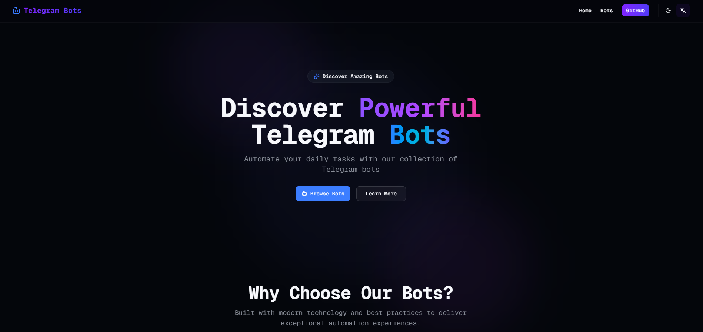
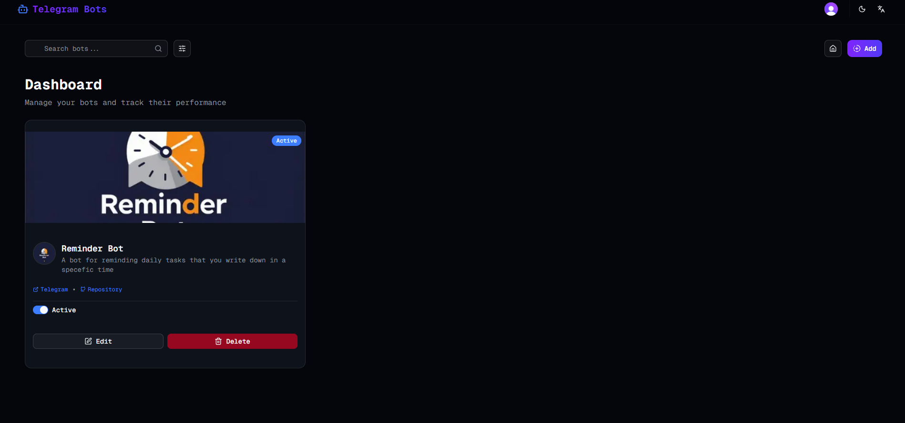

# 🤖 Telegram Bots Showcase

<div align="center">

A beautiful, modern landing page to showcase your Telegram bots with a powerful admin dashboard. Built with Next.js 15, Clerk Auth, UploadThing, TanStack Query, shadcn/ui, and Neon PostgreSQL.

[](https://nextjs.org/)
[](https://www.typescriptlang.org/)
[](https://tailwindcss.com/)
[](LICENSE)

</div>

---

## 📸 Screenshots

### Home Page



### Dashboard



## ✨ Features

### 🌐 Public Website

- 🎨 **Beautiful Dark Mode** - Stunning purple/blue color scheme
- 🚀 **Lightning Fast** - Optimized with Next.js 15 and React Server Components
- 📱 **Fully Responsive** - Perfect on mobile, tablet, and desktop
- 🔄 **Infinite Pagination** - Load more bots seamlessly
- 🎯 **Type-Safe** - Built with TypeScript and Drizzle ORM
- 🔍 **SEO Optimized** - Great for discoverability
- ♿ **Accessible** - WCAG compliant
- 🎭 **Modern UI** - Powered by shadcn/ui

### 🔐 Admin Dashboard

- 🔒 **Clerk Authentication** - Secure admin-only access with dark theme
- 📤 **UploadThing Integration** - Upload bot images (4MB max, png/jpeg/webp)
- ✏️ **CRUD Operations** - Create, edit, delete bots with modal forms
- 🔍 **Search & Filter** - Search by name/description, filter by status
- 🎛️ **Status Toggle** - Switch bots between Active/Down
- 🃏 **Card Layout** - Beautiful grid layout with bot cards
- 🎉 **Toast Notifications** - Success/error feedback with Sonner
- ✅ **Zod Validation** - Type-safe form validation

## 🚀 Quick Start

### Prerequisites

- Node.js 18 or higher (or Bun)
- [Neon](https://neon.tech) database account (free tier)
- [Clerk](https://clerk.com) account (free tier)
- [UploadThing](https://uploadthing.com) account (free tier)

### Installation

1. **Clone the repository**

   ```bash
   git clone <your-repo-url>
   cd bots
   ```

2. **Install dependencies**

   ```bash
   bun install
   # or npm install
   ```

3. **Set up environment variables**

   Create `.env` file in the root:

   ```env
   # Database
   DATABASE_URL="postgresql://..."

   # Clerk Authentication
   NEXT_PUBLIC_CLERK_PUBLISHABLE_KEY="pk_test_..."
   CLERK_SECRET_KEY="sk_test_..."

   # Admin User ID (Your Clerk User ID)
   ADMIN_USER_ID="user_..."
   NEXT_PUBLIC_ADMIN_USER_ID="user_..."

   # UploadThing
   UPLOADTHING_SECRET="sk_live_..."
   UPLOADTHING_APP_ID="..."
   ```

4. **Get Clerk Credentials**

   - Go to [clerk.com](https://clerk.com) and create an account
   - Create a new application
   - Copy API keys from dashboard
   - Sign in to your app and copy your User ID from Clerk Dashboard → Users
   - Add your User ID to both `ADMIN_USER_ID` and `NEXT_PUBLIC_ADMIN_USER_ID`

5. **Get UploadThing Credentials**

   - Go to [uploadthing.com](https://uploadthing.com) and create an account
   - Create a new app
   - Copy Secret and App ID from dashboard

6. **Set up the database**

   ```bash
   bun drizzle-kit generate
   bun drizzle-kit push
   ```

7. **Run the development server**

   ```bash
   bun dev
   # or npm run dev
   ```

   Open [http://localhost:3000](http://localhost:3000)

## 🎯 Usage

### Public Pages

- **Home** (`/`) - Hero, features, showcase of active bots, CTA with WhatsApp link
- **All Bots** (`/bots`) - All active bots with infinite scroll
- **Bot Detail** (`/bots/[id]`) - Individual bot details

> **Note:** Only **active** bots are displayed on public pages

### Admin Dashboard

1. **Access**: Navigate to `/admin/dashboard` (only visible when signed in as admin)
2. **Search**: Type in search box to find bots by name or description
3. **Filter**: Select status filter (All, Active, Down)
4. **Create**: Click "Add New Bot" → Fill form → Upload images → Submit
5. **Edit**: Click "Edit" on any bot card → Update data → Submit
6. **Delete**: Click "Delete" → Confirm in dialog
7. **Toggle Status**: Use switch on each card to toggle Active/Down

## 🛠️ Tech Stack

| Category                | Technology              |
| ----------------------- | ----------------------- |
| **Framework**           | Next.js 15 (App Router) |
| **Language**            | TypeScript              |
| **Styling**             | Tailwind CSS 4          |
| **UI Components**       | shadcn/ui (Radix UI)    |
| **Icons**               | Lucide React            |
| **Data Fetching**       | TanStack Query          |
| **Database**            | Neon (PostgreSQL)       |
| **ORM**                 | Drizzle ORM             |
| **Authentication**      | Clerk                   |
| **File Upload**         | UploadThing             |
| **Form Validation**     | Zod + React Hook Form   |
| **Toast Notifications** | Sonner                  |
| **Deployment**          | Vercel                  |

## 📁 Project Structure

```
bots/
├── app/
│   ├── admin/
│   │   └── dashboard/
│   │       └── page.tsx        # Admin dashboard
│   ├── api/
│   │   └── uploadthing/
│   │       ├── core.ts         # UploadThing config
│   │       └── route.ts        # API route
│   ├── bots/                   # Bot pages
│   ├── layout.tsx              # Root layout (Clerk provider)
│   ├── page.tsx                # Home page
│   └── providers.tsx           # TanStack Query
├── components/
│   ├── cards/
│   │   └── bot-card.tsx        # Public bot card
│   ├── dashboard/
│   │   └── bot-card.tsx        # Admin bot card
│   ├── forms/
│   │   └── bot-form.tsx        # Bot create/edit modal
│   ├── layouts/
│   │   ├── header.tsx          # Header with admin link
│   │   └── footer.tsx
│   ├── sections/               # Page sections
│   ├── shared/
│   │   ├── confirmation-dialog.tsx  # Reusable confirmation
│   │   └── image-upload.tsx         # UploadThing component
│   └── ui/                     # shadcn/ui components
├── lib/
│   ├── actions/
│   │   └── bot.ts              # Server actions (CRUD + filters)
│   ├── constants/
│   │   ├── enum.ts
│   │   ├── query-keys.ts       # TanStack Query keys
│   │   └── urls.ts             # Route constants
│   ├── db/
│   │   ├── client.ts           # Database client
│   │   └── schema.ts           # Drizzle schema
│   ├── queries/
│   │   └── bot.ts              # TanStack Query hooks
│   └── uploadthing.ts          # UploadThing helpers
├── types/
│   └── validation/
│       └── bot.ts              # Zod schemas
├── middleware.ts               # Clerk middleware (admin protection)
└── docs/                       # Documentation
```

## 📊 Database Schema

```typescript
bots {
  id: UUID;              // Auto-generated
  userId: string;        // Clerk user ID (creator)
  name: string;          // Bot name
  description: string;   // Bot description
  image: string;         // Cover image URL (from UploadThing)
  iconImage: string;     // Icon URL (from UploadThing)
  link: string;          // Telegram bot link
  repoLink: string;      // GitHub repository
  status: 'active' | 'down';  // Bot status
  createdAt: Date;       // Auto-generated
  updatedAt: Date;       // Auto-updated
}
```

## 🎨 Security

- **Admin Protection**: Middleware checks admin user ID before allowing `/admin/*` routes
- **Server-Side Validation**: All mutations verify admin user ID in server actions
- **Upload Security**: UploadThing validates admin before allowing file uploads
- **Public Safety**: Public users only see **active** bots (down bots hidden)

## 🔄 Data Invalidation

The app uses TanStack Query for automatic cache invalidation:

- **Create Bot**: Invalidates admin list, public limited, and public infinite queries
- **Update Bot**: Invalidates admin list, public queries, and specific bot query
- **Delete Bot**: Invalidates admin list and all public bot queries
- **Toggle Status**: Invalidates all bot queries to reflect status changes

This ensures the dashboard and public pages stay in sync automatically!

## 🚀 Deployment

### Deploy to Vercel (Recommended)

1. Push your code to GitHub
2. Import project on [Vercel](https://vercel.com)
3. Add environment variables:
   - `DATABASE_URL`
   - `NEXT_PUBLIC_CLERK_PUBLISHABLE_KEY`
   - `CLERK_SECRET_KEY`
   - `ADMIN_USER_ID`
   - `NEXT_PUBLIC_ADMIN_USER_ID`
   - `UPLOADTHING_SECRET`
   - `UPLOADTHING_APP_ID`
4. Deploy!

### Build Locally

```bash
bun run build
bun run start
```

## 📝 Scripts

```bash
bun dev              # Start development server
bun build            # Build for production
bun start            # Start production server
bun lint             # Run ESLint
bun drizzle-kit generate  # Generate Drizzle migrations
bun drizzle-kit push      # Push schema to database
```

## 🤝 Contributing

Contributions are welcome! Please read [AGENTS.md](./AGENTS.md) for coding standards.

1. Fork the repository
2. Create your feature branch (`git checkout -b feature/amazing`)
3. Commit your changes (`git commit -m 'Add amazing feature'`)
4. Push to the branch (`git push origin feature/amazing`)
5. Open a Pull Request

## 📖 Documentation

- [Component Organization](./docs/component-organization.md)
- [Data Fetching](./docs/data-fetching.md)
- [UI Components](./docs/ui-components.md)
- [Authentication](./docs/authentication.md)
- [Forms & Validation](./docs/forms-validation.md)

## 📄 License

MIT License - feel free to use for your projects!

## 🙏 Acknowledgments

- [Next.js](https://nextjs.org/) - React framework
- [shadcn/ui](https://ui.shadcn.com/) - UI components
- [TanStack Query](https://tanstack.com/query) - Data fetching
- [Drizzle ORM](https://orm.drizzle.team/) - Type-safe ORM
- [Neon](https://neon.tech/) - Serverless Postgres
- [Clerk](https://clerk.com/) - Authentication
- [UploadThing](https://uploadthing.com/) - File uploads
- [Lucide](https://lucide.dev/) - Icons
- [Tailwind CSS](https://tailwindcss.com/) - Styling

---

<div align="center">

**Built with ❤️ for the Telegram bot community**

[⭐ Star this repo](https://github.com/Ahmad-Softwaree/bots)

</div>
